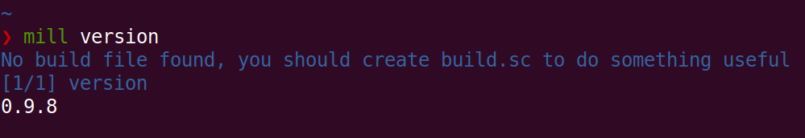

环境搭建
=========

实验目的
--------

- 在电脑上安装今后实验所需要的工具
- 初步了解一个简单电路的实现和仿真流程
- 为后续的实验打下基础

实验设备
--------
- Ubuntu操作系统的电脑一台，或装有Ubuntu操作系统的虚拟机

实验任务
--------

- 在系统中安装jdk-13
- 在系统中安装mill-0.9.8
- 在系统中安装verilator-3.916
- 使用verilog编写一个简单的译码器，并通过verilator编译并仿真运行

.. hint:: 
    1.	由于安装和下载程序可能会需要比较久的时间，强烈建议在课前预习时完成安装
    2.	如果没有课前预习，可以导入打包好的VirtualBox镜像，里面已经将需要用到的环境配置好了，但是仍然希望同学在课后自己尝试安装一遍
    3.	在实验指导中给出了在设计本课程时使用到的程序版本，今后如果有大的更新影响到我们的代码或者程序行为的正确性时，请及时更新实验指导

实验内容
--------

安装JDK
*******
安装jdk的原因是mill使用时会用到jdk，因为mill不仅能够编译Scala，也能够用来构建java的工程。在Ubuntu中可以直接通过以下命令安装

.. code-block:: shell

    sudo apt install -y openjdk-13-jdk

这是最直接最简单的方法，但是在真实安装过程中，可能会由于软件源的问题，导致下载的速度非常的慢。
可以通过换源，或者自己直接通过网站下载好之后解压到指定的目录安装，再配置好环境变量后使用，具体的操作可以在网上搜索。
总之，想办法把jdk安装好，在执行 ``java --version`` 后会输出版本信息，就代表安装完成了。

.. code-block:: shell

    > java --version
    openjdk 11.0.13 2021-10-19
    OpenJDK Runtime Environment GraalVM CE 21.3.0 (build 11.0.13+7-jvmci-21.3-b05)
    OpenJDK 64-Bit Server VM GraalVM CE 21.3.0 (build 11.0.13+7-jvmci-21.3-b05, mixed mode, sharing)

安装mill
********

`mill <https://com-lihaoyi.github.io/mill/mill/Intro_to_Mill.html>`_ 是LC3项目使用的build tool，用来将我们写的Chisel代码编译成verilog代码，在之后的实验中会使用到。
安装mill首先需要安装curl程序，curl是一个利用URL规则在命令行下工作的文件传输工具。
安装完curl，利用该工具安装mill并加执行权限。

.. code-block:: shell

    sudo apt install -y curl
    mill sudo bash -c "curl -L https://github.com/com-lihaoyi/mill/releases/download/0.9.8/0.9.8 >
    /usr/local/bin/mill && chmod +x /usr/local/bin/mill"

之后运行 ``mill version`` 命令，第一次运行它会下载一些必要的文件，可能需要等待一段时间，在运行完成后你应该看到你安装的mill的版本号，这代表mill安装完成。

.. caution:: 
    请确保使用的mill版本正确，否则编译时可能会报未知的错误

    fig1-1: mill version

安装verilator
*************

`Verilator <https://www.veripool.org/verilator/>`_ 和curl一样，直接安装后查看版本。

.. code-block:: shell

    sudo apt install -y verilator
    verilator --version

.. figure:: _static/verilator.png
    :alt: verilator
    :align: center

    fig1-2: verilator version
   

简单电路设计
************
接下来我们可能会需要写一些代码，在每次迭代中，我们首先需要编写或修改Chisel的代码，然后使用mill将其编译生成对应的verilog代码，然后再用verilator将其编译转换成用来仿真的C++代码，最后再执行仿真。
当然这个过程比较复杂，一般都是用make或cmake之类的命令来控制的，这个具体的流程可以留到下一次实验来做，这节课我们可以先写点简单的：用verilog编写一个3-8译码器，然后用verilator将它运行起来

在学习Chisel语言之前，我们需要先学习一些简单的verilog语法，verilog是一种硬件描述语言，用于数字电路的系统设计，也是目前在集成电路设计领域使用最广泛的语言之一（使用同样广泛的还有System Verilog和VHDL语言，有兴趣可以了解一下）。verilog入门可以参考 `verilog 基础语法 <https://www.runoob.com/w3cnote/verilog-basic-syntax.html/>`_，建议大家先学习前4章，由于Chisel翻译出的verilog代码并不会使用进阶的语法，因此对进阶的语法感兴趣的同学可以课后自行学习。

**编写一个3-8译码器**
在学习了verilog的基础语法后，接下来我们看一下需要实现的模块功能。3-8译码器是一个纯组合逻辑，输入3bit的信号，表示0-7的二进制数字n，返回一个8bit的信号，其中第n位是1，其它位都是0，下表是3-8译码器的真值表：

.. +-----+--------+--------+--------+---------+---------+---------+---------+---------+---------+---------+---------+
.. | in  | in[2]  | in[1]  | in[0]  | out[7]  | out[6]  | out[5]  | out[4]  | out[3]  | out[2]  | out[1]  | out[0]  |
.. +=====+========+========+========+=========+=========+=========+=========+=========+=========+=========+=========+
.. | 0   | 0      | 0      | 0      | 0       | 0       | 0       | 0       | 0       | 0       | 0       | **1**   |
.. +-----+--------+--------+--------+---------+---------+---------+---------+---------+---------+---------+---------+
.. | 1   | 0      | 0      | 1      | 0       | 0       | 0       | 0       | 0       | 0       | **1**   | 0       |
.. +-----+--------+--------+--------+---------+---------+---------+---------+---------+---------+---------+---------+
.. | 2   | 0      | 1      | 0      | 0       | 0       | 0       | 0       | 0       | **1**   | 0       | 0       |
.. +-----+--------+--------+--------+---------+---------+---------+---------+---------+---------+---------+---------+
.. | 3   | 0      | 1      | 1      | 0       | 0       | 0       | 0       | **1**   | 0       | 0       | 0       |
.. +-----+--------+--------+--------+---------+---------+---------+---------+---------+---------+---------+---------+
.. | 4   | 1      | 0      | 0      | 0       | 0       | 0       | **1**   | 0       | 0       | 0       | 0       |
.. +-----+--------+--------+--------+---------+---------+---------+---------+---------+---------+---------+---------+
.. | 5   | 1      | 0      | 1      | 0       | 0       | **1**   | 0       | 0       | 0       | 0       | 0       |
.. +-----+--------+--------+--------+---------+---------+---------+---------+---------+---------+---------+---------+
.. | 6   | 1      | 1      | 0      | 0       | **1**   | 0       | 0       | 0       | 0       | 0       | 0       |
.. +-----+--------+--------+--------+---------+---------+---------+---------+---------+---------+---------+---------+
.. | 7   | 1      | 1      | 1      | **1**   | 0       | 0       | 0       | 0       | 0       | 0       | 0       |
.. +-----+--------+--------+--------+---------+---------+---------+---------+---------+---------+---------+---------+

    table1-1: 3-8译码器真值表

首先我们找个合适的路径，新建一个目录，取名为decoder，然后进入到这个目录下。新建一个文件decoder.v，接下来按照给出的真值表，用verilog编写相应的模块功能代码，下面以及给出了基本的模块定义和部分代码，请大家在学习了verilog的基础知识后，将模块代码补全。

.. code-block:: verilog

    // decoder.v
    module decoder(
    input [2:0] in,
    output [7:0] out
    );

    reg [7:0] out_reg;;

    always @(*) begin
    /*
        请在此处补完缺失的代码
    */
    endmodule

在得到verilog代码之后，接下来要使用Verilator将其编译转换成仿真模型，在电脑上用程序模拟真实的硬件行为，Verilator会把verilog代码中的设计用C++程序编译成可执行文件，在编译前，我们需要先写一个顶层的main函数，将我们的模块包裹起来，顶层模块用于控制一些模块外的设置和功能，例如在这次实验中，我们在main函数中控制译码器的输入信号，从0开始，每周期递增1，一直到7为止。在接下来的实验中我们还会在main函数中模拟时钟每周期的跳变。Verilator的详细使用方法可以参考 `Verilator手册 <https://veripool.org/guide/latest/index.html/>`_。

Verilator会将verilog代码中的模块编译成一个"V+模块名"的头文件和C++文件，我们在include头文件后，可以在main函数中我们直接定义这个模块，就可以控制查看这个模块的接口信息。在main函数中，我们每周期将译码器输出端口的值用二进制格式输出。我们在decoder.v文件相同的目录下创建一个sim_main.cpp文件，这里直接给出main函数的代码，希望同学能够仔细学习，掌握main函数例化模块的过程。

.. code-block:: c++

    // sim_main.cpp
    #include "Vdecoder.h" // 这个头文件会根据你模块的名字不同而改变
    #include <verilated.h>
    #include <iostream>
    #include <bitset> // 用于输出二进制的数据

    using namespace std;

    int main(int argc, char **argv, char **env){
        Verilated::commandArgs(argc, argv);
        Vdecoder* decoder = new Vdecoder;  // 模块的实例

        int code = 0; // 用于decoder模块的输入，从0-7遍历

        while (!Verilated::gotFinish() && code < 8) {
            decoder->in = code;

            decoder->eval(); // 每执行一次eval函数，就对decoder模块执行一次仿真
            cout<<"in: "<<code<<"\t";
            cout<<"out: "<<bitset<8>(decoder->out)<<endl; // 输出deocder模块的out接口的信号

            code++;
        }

        decoder->final();
        delete decoder;
        exit(0);
    }

现在你的decode目录下应该有两个文件了，分别是decoder.v和sim_main.cpp，接下来我们使用Verilator将verilog代码转换成仿真需要用到的文件，包括.h和.cpp文件和其他的一些文件，
在decoder目录下运行如下命令:

.. code-block:: shell

    verilator -Wall --cc decoder.v --exe sim_main.cpp

如果你的代码都正确无误的话，你应该能够看到在当前目录下生成了一个新的目录obj_dir，进到这个目录后能够看到这些文件。否则应该会输出相关的错误信息，需要根据信息修改代码，直到编译通过。

    fig1-3: 生成的文件

在obj_dir目录下，我们可以看到Vdecoder.mk文件，它是一个Verilator自动生成的Makefile文件，我们不用编辑它。
接下来回到decoder目录，运行命令

.. code-block:: shell

    make -C ./obj_dir -f ./Vdecoder.mk
    
就会看到在obj_dir目录下新生成了一个名为Vdecoder的可执行文件，运行这个文件，就会开始对我们的模块进行仿真，就能够看到decoder这个模块对应的输入和输出，确保它的功能正常。
如果运行时出现了错误，请耐心的按照错误信息定位检查代码中的问题

    fig1-4: decoder仿真输出

实验总结
--------

通过本节课，希望大家能够掌握：

- Chisel开发环境的搭建
  
- 掌握verilog的基本语法
  
- 使用verilator对verilog代码进行仿真的流程，以及相应代码的作用
