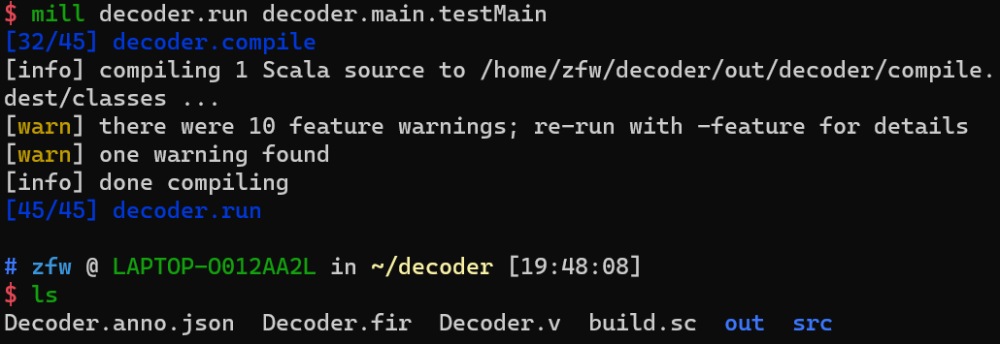
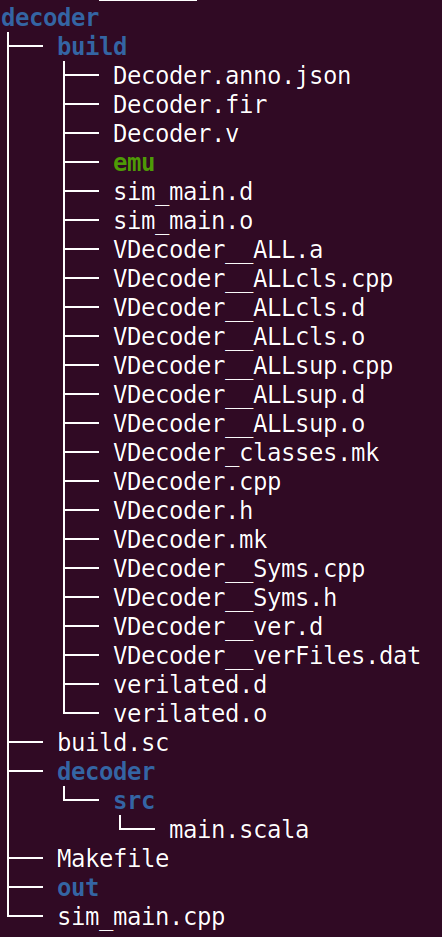
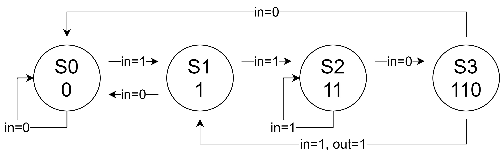
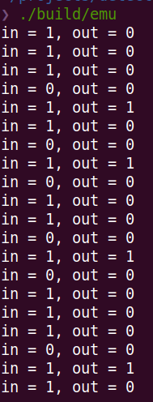

组合电路与时序电路设计
===========

实验目的
--------

- 了解基本的Chisel语法
- 掌握完整的从Chisel到仿真的开发流程现和仿真流程
- 学会编写Makefile将编译过程自动化，实现一键仿真

实验设备
--------
- Ubuntu操作系统的电脑一台，或装有Ubuntu操作系统的虚拟机

实验任务
--------

- 使用Chisel重新实现在实验一中用verilog编写的3-8译码器
- 编写build.sc文件，指定Scala和Chisel的版本
- 编写Makefile文件，指定编译仿真的规则
- 使用Chisel实现一个简单状态机，能够检测序列1101

实验内容
--------

使用Chisel实现3-8译码器
***********************
在上一节实验课中用verilog实现了一个3-8译码器，现在要用Chisel重新实现它。在编写代码前，首先需要学习Chisel语法相关的知识，Chisel是一个开源的硬件构造语言，是建构在Scala语言之上的领域专用语言（DSL），不同于verilog，Chisel中可以使用更高级的语言特性来描述电路，可以使用面向对象编程思想，通过简洁的代码实现复杂的电路功能。这里推荐通过 `Chisl Bootcamp <https://github.com/freechipsproject/chisel-bootcamp>`_ 学习，bootcamp给出了一个在线的 `练习系统 <https://mybinder.org/v2/gh/freechipsproject/chisel-bootcamp/master>`_，可以在上面按照教程直接编写Chisel代码，并查看运行结果。

在学习了Chisel的基本语法后，就可以开始着手将实验一中的3-8译码器用Chisel重写了，

首先在decoder目录下再新建一个decoder/src目录，这是由mill的项目格式规定的将Chisel的代码放在这个目录下。由于这个译码电路实在是过于简单，因此你可能看不出Chisel相比于verilog有什么优势，但是随着你设计的电路越来越复杂，你会发现Chisel能极大的提高你的效率。

首先在decoder/src目录下新建一个main.scala文件，参考代码如下，和实验一一样，给出了基本的模块定义，其中的具体实现代码需要补全。

.. hint:: 
    整个实验指导中所说的decoder目录都是外面这个decoder目录，而不是里面嵌套的这个目录，整个目录的结构在图2-2中可以看到

.. code-block:: scala

    // ./decoder/src/main.scala
    package decoder
    import chisel3._
    import chisel3.util._
    import chisel3.stage._
    // RawModule与Module不同，它不会生成隐式的时钟，由于译码器是组合电路，
    // 因此现在还没有涉及到时钟的概念，只用RawModule即可
    class Decoder extends RawModule {
        val io = IO(new Bundle{
            val in = Input(UInt(3.W)) // 输入的0-7信号，二进制表示只需要3bits宽即可
            val out = Output(UInt(8.W)) // 输出的译码后信号，8bits宽
        })
        // 在Chisel中，可以对同一个变量多次赋值，以最后一次赋的值为最终结果
        // 因此如果下面的语句都没有执行，这一行能给io.out一个默认值
        io.out := "b00000000".U
        /*
            请在此处补完缺失的代码
        */
    }
    object testMain extends App {
        // 实例化Decoder模块
        (new ChiselStage).execute(args, Seq(
            ChiselGeneratorAnnotation(() => new Decoder))
        )
    }

在main.scala中，首先定义了Decoder这个类，继承了RawModule这个基类，在大部分电路设计时，更多继承的是Module这个类，Module类与RawModule类的区别在于，Module类虽然没有显示的定义，但是会隐式地包含clock和reset这两个接口，一个用于从外部接入时钟，一个用于从外部接受模块的reset信号。而RawModule则没有这两个隐式的接口，考虑到3-8译码器并不需要时钟和reset，因此这里继承RawModule即可。更多关于Chisel的API

之后定义了一个单例对象testMain，继承App类，这是Chisel例化顶层模块的基本形式，在其中例化生成了一个Decoder。

.. hint:: 
    在编程或者阅读代码时遇到没有见过的方法或类型，可以参考 `Chisl API <https://www.chisel-lang.org/api/latest/index.html>`_ 和 `Scala API <https://www.scala-lang.org/api/current/scala/index.html>`_

编写build.sc文件
****************

在decoder目录下新建一个build.sc文件，写入如下代码

.. code-block:: scala

    import mill._, scalalib._
    import os.Path
    /**
     * Scala 2.12 module that is source-compatible with 2.11.
     * This is due to Chisel's use of structural types. See
     * https://github.com/freechipsproject/chisel3/issues/606
     */
    trait HasXsource211 extends ScalaModule {
      override def scalacOptions = T {
        super.scalacOptions() ++ Seq(
          "-deprecation",
          "-unchecked",
          "-Xsource:2.11"
        )
      }
    }
    
    object decoder extends ScalaModule with HasXsource211 {
        def scalaVersion = "2.12.10"
        override def millSourcePath = os.pwd
        def ivyDeps = Agg(
            ivy"edu.berkeley.cs::chisel3:3.5.0-RC1"
        )
    }

其中HasXsource211这个trait中的设置是为了避免一些兼容性问题，在这个实验中即使不加也不会有问题，但是在今后的实验中缺少这个可能会导致一些错误，因此建议还是加上
除去上面的trait，就只剩下deocder这一个单例对象了，其中的代码很简单，指定了使用2.12.10版本的Scala，指定了3.3.5版本的Chisel。在编写完build.sc文件之后，实际上你已经可以开始使用mill将Chisel转换成verilog文件了，运行如下命令

.. code-block:: shell

    mill decoder.run decoder.main.testMain

你会看到一些警告，可以不用理会，在运行结束后，如果没有错误的话，你会在decode目录下看到生成的Decoder.v文件，如下图所示

    fig2-1: 运行mill后看到生成的Decoder.v文件

你可以打开Decoer.v文件，看看它和你自己写的verilog有什么区别，你也可以尝试用verilator仿真运行它.

编写Makefile文件
****************

如果你在之前的实验中编写的代码出现了一些错误，导致你每次都要重复的输入这些命令，那么你应该已经开始厌烦了，
因此需要编写一个Makefile，通过make命令来自动管理这些代码和命令，这样在之后的开发过程中就能省下大量的精力。

Makefile是在Linux环境下的一个工程管理文件。当你使用make命令去编译一个项目时，make命令会首先到这个项目的根目录下去寻找Makefile文件，然后才能根据这个文件去编译程序，可以将其理解成一个脚本，将之前手动编译Chisel，verilog和运行的命令打包起来，这样只要执行make命令，就能够按顺序执行这些指令。 `这里 <https://www.coonote.com/linux-note/makefile-simple-tutorial.html>`_ 是一个简单的Makefile教程， 当然如果遇到没有见过的命令，最好还是直接查找Makefile的 `官方手册 <https://www.gnu.org/software/make/manual/make.html>`_。

首先在decoder目录下新建一个Makefile文件，内容如下：

.. code-block:: shell

    # Makefile
    TOP = Decoder # 定义了顶层模块的名字，这里就是Decoder
    BUILD_DIR = ./build # 定义了编译生成的文件存放路径，通常都是单独放在build目录下
    TOP_V = $(BUILD_DIR)/$(TOP).v # 这是verilog文件的路径，是由Chisel编译生成的verilog文件，在build目录中
    SCALA_FILE = $(shell find ./decoder/src -name '*.scala') # decoder/src目录下所有的Scala和Chisel文件

    .DEFAULT_GOAL = verilog # 规定了默认的编译目标，例如这里，运行make，等同于运行 make verilog命令

    $(TOP_V): $(SCALA_FILE) # 这里找到所有的Chisel源文件，然后用mill将Chisel代码编译为verilog文件
    	@mkdir -p $(@D)
    	mill decoder.run decoder.main.testMain -td $(@D) --output-file $(@F)

    verilog: $(TOP_V) # 生成verilog文件，而不会使用VCerilator编译生成可执行文件

    SIM_TOP = Decoder # 用于仿真的顶层模块，这里也是Decoder

    EMU_MK := $(BUILD_DIR)/V$(SIM_TOP).mk # 用Verilator编译之后自动生成的Makefile文件路径
    EMU := $(BUILD_DIR)/emu # 用Verilator编译之后自动生成的可执行文件路径
    CXX_FILE := ./sim_main.cpp # Verilator的顶层main函数源文件

     # 找到verilog文件，用Verilator编译，生成相关的头文件和C++代码，以及Makfile文件
     # EMU_DEPS代表生成EMU可能需要的一些依赖文件，这里没有可以直接忽视
    $(EMU_MK): $(TOP_V) | $(EMU_DEPS)
    	@mkdir -p $(@D)
    	verilator -Wall --cc --exe \
    		-o $(abspath $(EMU)) -Mdir $(@D) $^ $(CXX_FILE)

    $(EMU): $(EMU_MK) # 执行Verilator生成的Makefile文件，生成用于仿真的可执行文件。
    	$(MAKE) -C $(dir $(EMU_MK)) -f $(abspath $(EMU_MK))

    emu: $(EMU)

    clean: # 用于删除build中所有生成的文件
    	rm -rf build

每部分代码都有相关功能的注释，总体来说，在这个Makefile文件中，定义了三个主要的target，分别是verilog，emu和clean，其中clean就是一条rm指令，把编译生成的build文件夹删掉，而verilog指令会将Chisel文件编译成verilog，make emu与make verilog的区别在于它不光会将Chisel文件编译成verilog代码，还会将verilog代码转换成仿真使用的C++代码，并将最终的可执行文件存放在build目录下。另外，记得确认上一节课的sim_main.cpp在当前的decoder目录下。总之，如果之前的操作都正确的话，现在你可以直接运行make emu来一键生成仿真程序了，此时你完整的项目目录应该如下图所示：

    fig2-2: 完整的项目结构

运行./build/emu后应该能看到和实验一一样的输出。

使用Chisel实现序列检测
***********************

接下来尝试使用Chisel来描述一个有限状态机 (FSM)，并用它来检测1101的固定序列。

题目描述如下：按照时间周期，输入一个长序列：{1, 1, 1, 0, 1, 1, 0, 1, 0, 1, 1, 0, 1, 0}，每周期输入一个bit，当周期的bit和前3个周期的bit拼起来正好是1101序列时，输出1，其余时间输出0

可以看出，这道题和3-8译码器最大的区别在于，它需要记录之前周期的状态，即输出不仅取决于当周期的输入信号，而且还取决于电路原来的状态，这就是时序电路和组合电路的区别。

首先请按照题目描述，尝试画出相应的状态转移图

    fig2-3: 状态转移图

接下来新建一个Chisel项目，也可以将之前decoder目录直接复制一遍，但是推荐自己从头开始完整的走一遍新建项目的流程，这过程中能对这个项目结构有更深的了解

.. hint:: 
    Makfile中VCerilator的编译命令可以尝试去掉其中的-Wall参数，看看有什么不同，查阅手册看看这个参数是什么作用

之后编写Chisel中的序列检测代码，需要注意的是这次Detection继承的不再是RawModule类，而是Module类，因为它是时序逻辑，需要保存每个周期的状态，因此需要接入时钟，但是在本题中时钟并不需要显式的使用。基本的代码框架已给出，请在注释处补完主要的功能代码。

.. code-block:: scala

    // detection/src/main.scala
    package detection

    import chisel3._
    import chisel3.util._

    class Detection extends Module {
        val io = IO(new Bundle{
            val in = Input(Bool()) // 输入序列，每周期输入1 bit
            val out = Output(Bool()) // 输出的信号，当检测到“1101”序列时输出1，其他时间为0
        })

        /*
            请在此处补完缺失的代码
        */

        printf(p"in = ${io.in}, out = ${io.out}\n")
    }

    object testMain extends App {
        Driver.execute(args, () => new Detection)
    }

Chisel代码完成后，还需要修改sim_main.cpp顶层文件，在测试3-8译码器时，在主循环中每次迭代修改传送给decoder的输入，并读出decoder的输出端口的值。
而在编写时序逻辑时，首先需要在顶层实现一个时钟信号。也就是定义一个变量，隔一段时间对它进行一次翻转。另外在顶层函数中定义想要给fetection输入的序列seq，并且每周期将其中的元素递增送往detection模块。sim_main.cpp的顶层框架代码如下：

.. code-block:: scala

    // sim_main.cpp
    #include "VDetection.h"
    #include <verilated.h>
    #include <iostream>
    #include <bitset>

    using namespace std;

    int main(int argc, char **argv, char **env){
        Verilated::commandArgs(argc, argv);
        VDetection* detection = new VDetection;

        int main_time = 0;
        int seq_ptr = 0;
        int seq[] = {1, 1, 1, 0, 1, 1, 0, 1, 0, 1, 1, 0, 1, 0};

        while (!Verilated::gotFinish() && main_time <= 200) {

            if ((main_time % 10) == 1) {
                detection->clock = 1;
            }
            if ((main_time % 10) == 6) {
                detection->clock = 0;

                seq_ptr = (seq_ptr + 1) % 14;
                // cout<<"in: "<<seq[seq_ptr]<<"\t";
                // cout<<"out: "<<bitset<1>(detection->io_out)<<endl<<endl;
            }

            detection->io_in = seq[seq_ptr];
            detection->eval();
            main_time++;
        }

        detection->final();
        delete detection;
        exit(0);
    }

.. hint:: 
    这次将用于调试的printf函数改为了使用Chisel中的printf函数，而没有选择在sim_main.cpp里输出，为什么要这样，如果改成在sim_main.cpp中输出会有什么效果？

如果实现无误，最终运行应该能够看到类似的输出：

    fig2-4: 序列检测运行结果

实验总结
--------
通过本节课，希望大家能够掌握：
- 使用Chisel编写简单模块
- 编写build.sc来控制Scala和Chisel的版本，以及今后其他的一些依赖环境
- Makefile的语法，能够通过make指令使编译更简便，加快开发速度
