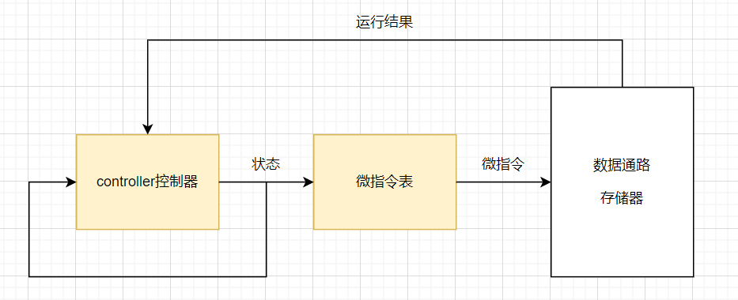

LC3控制器的设计
===============

实验目的
---------

- 熟悉LC3微结构，具体请仔细阅读 **《计算机系统概论》 附录C** 。
- 了解LC3中controller原理并使用chisel语言进行设计和验证。

实验设备    
--------
- Ubuntu操作系统的电脑一台，或装有Ubuntu操作系统的虚拟机

实验任务
--------

- 仔细阅读 **《计算机系统概论》 附录C**
- 根据状态转移图，编写控制器中的状态机

.. tip:: 
    《计算机系统概论》 附录C中的内容为LC3内部架构的细节和规范，相当于设计的蓝图，熟悉内部架构对后续实验有极大帮助。

实验内容
--------

.. caution::
    实验开始前假设你已经阅读过一遍《计算机系统概论》 附录C，否则建议先阅读。

Controller的设计
****************

Controller 是计算机中最为核心的一个部件，控制着机器的运行行为。
在LC3中，Controller的功能为接收上一周期的运算结果，根据上周期的状态生成本周期的状态，最后根据生成的状态查表得到控制信号（微指令），并传送给数据通路和存储器，让其做出对应的工作。原理如图所示：

    fig3-1: controller结构图

其中状态转换以及状态编号在《计算机系统概论》p369 和 p377。而控制信号（微指令）在p371-372。每一个状态对应一个控制信号列表，可视为一个二维数组，该二位数组即微指令表。

**控制信号**：信号长度为49bits，微指令表的容量则为状态数*49bits各信号含义如下:

=============== ============================================================================ 
 信号名称           含义                                                                           
=============== ============================================================================ 
 LD.*            该信号为1的时候,寄存器 \* 的值才能被改变。                                                       
 Gate*           该信号为1的时候，寄存器 \* 才能在在总线上传输（通常通过总线传到另一个寄存器）。由于总线只能传输一个信号，所有Gate \*同时只能有一个信号为1。    
 \*Mux           数据选择时的选择信号                                                                  
 ALUK            ALU的操作类型                                                                    
 MIO.EN          是否要读写内存                                                                     
 R.W             内存操作读还是写                                                                    
=============== ============================================================================ 

.. tip:: 

    举例：

    1. 在状态机号35时，操作为IR<-MDR，因此LD.IR和GateMDR都为1
    2. ADDR1MUX为0选择PC，为1时选择BaseR
|

    **Task1** (src/main/scala/LC3/controller.scala):根据《计算机系统概论》p369 和 p377列出所有的状态转移。根据当周期的状态在微指令表中索引出控制信号。

观察Controller结果
*******************
建立单元测试可以在不运行整个LC3情况下独立运行Controller。
1. 通过模块端口把状态机设置城运行状态。
2. 通过模块输入状态机转移的条件。
3. 观察状态机转移结果

我们以add指令在LC3的状态为例，状态转移顺序为 18, 33, 35, 32, 1 最后转移回到18。

.. figure:: _static/state.png
    :alt: state
    :align: center

    fig3-1: LC3状态机

测试代码如下：

.. code-block:: scala

    // src/test/scala/ControllerTest.scala

    class ControllerTest extends AnyFlatSpecwith ChiselScalatestTester  // chiseltest 类和依赖
    {
        behavior of "Controller"
  
        it should "test state machine" in {   //测试用例
            test(new Controller) { c =>

                // 初始状态
                c.io.work.poke(true.B) 
                c.io.end.poke(false.B)
                c.clock.step()
                println(s"io.state=${c.io.state.peek}")    // 初始为18

                // add指令状态转移
                c.io.in.int.poke(false.B)                  // 转移条件：int为0
                c.clock.step()
                println(s"io.state=${c.io.state.peek}")    // 转移为33

                c.io.in.r.poke(true.B)                     // 转移条件：r为1
                c.clock.step()
                println(s"io.state=${c.io.state.peek}")    // 转移为35

                c.clock.step()
                println(s"io.state=${c.io.state.peek}")    // 转移为32

                c.io.in.ir.poke(1.U)                       // 转移条件：ir为1
                c.clock.step()
                println(s"io.state=${c.io.state.peek}")    // 转移为1

                c.clock.step()
                println(s"io.state=${c.io.state.peek}")    // 指令结束，转移为18

            }
        }
    }

执行以下命令观察测试结果

.. code-block:: shell

    mill -i chisel_lc3.test.testOnly -o -s LC3.ControllerTest

.. figure:: _static/controllertest.png
    :alt: state
    :align: center

    fig3-2: 测试结果