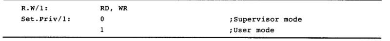

LC3控制器的设计
===============

实验目的
---------

- 熟悉LC3微结构，具体请仔细阅读 **《计算机系统概论》 附录C** 。
- 了解LC3中controller原理并使用chisel语言进行设计和验证。

实验设备    
--------
- Ubuntu操作系统的电脑一台，或装有Ubuntu操作系统的虚拟机

实验任务
--------

- 仔细阅读 **《计算机系统概论》 附录C**, 熟悉整体架构
- 根据状态转移图，编写控制器中的状态机

.. tip:: 
    《计算机系统概论》 附录C中的内容为LC3内部架构的细节和规范，相当于设计的蓝图，熟悉内部架构对后续实验有极大帮助。

实验内容
--------

.. caution::
    实验开始前假设你已经阅读过一遍《计算机系统概论》 附录C，否则建议先阅读。

LC3整体架构的讲解
****************
在完成前两章实验，相信大家对基本的硬件设计概念与Chisel语言有所了解，因此第三、四、五章将会根据模块自第向上完成LC3的设计。
在整体实验前我们需要熟悉LC3的整体架构，从模块上看LC3主要分为三个大模块、即控制器、数据通路和存储器，其中数据通路中含有两个较为重要的模块，为ALU和Regfile，结构如下图所示。
三个个大模块的工作流程为控制器发送控制信号到数据通路，数据通路根据信号进行取指、运算、访存等操作，其中访存操作数据通路会读写存储器。完成操作后数据通路将一些结果信号返回给控制器，控制器会生成新的控制信号，并重复“发送控制信号——接收反馈——发送新控制信号”的流程。

根据以上架构，按照模块设计将分为三章，内容如下：

1. 第三章：实现LC3的控制器模块，并对控制器进行单元测试。
   
2. 第四章：实现数据通路中的ALU，Regfile模块并作单元测试，接着实现存储器，然后完善数据通路的逻辑，最后将数据通路、ALU、Regfile、存储器组合成一个大模块。

3. 第五章：将控制器与数据通路组合成完整LC3并进行整体仿真。

Controller的设计
****************

Controller 是计算机中最为核心的一个部件，控制着机器的运行行为。
在LC3中，Controller的功能为接收上一周期的运算结果，根据上周期的状态生成本周期的状态，最后根据生成的状态查表得到控制信号（微指令），并传送给数据通路和存储器，让其做出对应的工作。原理如图所示：

    fig3-1: controller结构图

其中状态转换以及状态编号在《计算机系统概论》p369 和 p377。而控制信号（微指令）在 p371-372。每一个状态对应一个控制信号列表（该表见文末附录），可视为一个二维数组，该二位数组即微指令表。

**控制信号**：信号长度为49bits，微指令表的容量则为状态数*49bits，信号含义如下（详细含义见文末附录）:

+---------------+----------------------------------------------------------------------------+ 
| 信号名称      |    含义                                                                    |       
+===============+============================================================================+ 
| LD.*          |  该信号为1时,寄存器 \* 的值才能被改变。                                    |                    
+---------------+----------------------------------------------------------------------------+ 
| Gate*         | 该信号为1时，寄存器 \* 才能在在总线上传输（通常通过总线传到另一个寄        |
|               |                                                                            |
|               | 存器）。由于总线只能传输一个信号，所有Gate \*同时只能有一个信号为1。       |
+---------------+----------------------------------------------------------------------------+ 
| \*Mux         |  数据选择时的选择信号                                                      |
+---------------+----------------------------------------------------------------------------+
| ALUK          |  ALU的操作类型                                                             | 
+---------------+----------------------------------------------------------------------------+     
| MIO.EN        |  是否要读写内存                                                            |
+---------------+----------------------------------------------------------------------------+ 
| R.W           |  内存操作读还是写                                                          |
+---------------+----------------------------------------------------------------------------+ 
| Set.Priv      |  LC3执行模式                                                               |
+---------------+----------------------------------------------------------------------------+ 

.. tip:: 
    | 举例：
    | 1. 在状态机号35时，操作为IR<-MDR，因此LD.IR和GateMDR都为1
    | 2. ADDR1MUX为0选择PC，为1时选择BaseR
|

**接口定义**: 根据控制器定义图fig3-1，可以提取出模块的输入输入信号。

+----------+--------------+----------------------------+
| 接口方向 | 接口信号     |  含义                      |
+==========+==============+============================+
| in       | sig          | J, COND, IDR的按位拼接     |
+----------+--------------+----------------------------+
| in       | INT          | 中断信号                   |
+----------+--------------+----------------------------+
| in       | R            | 内存控制，为1代表读写完    |
+----------+--------------+----------------------------+
| in       | IR           | 区分指令的比特位           |
+----------+--------------+----------------------------+
| in       | BEN          | 上一个运算的符号情况       |
+----------+--------------+----------------------------+
| in       | PSR          | 机器执行模式               |
+----------+--------------+----------------------------+
| out      | signalEntry  | 输出控制信号（见文末附录） |
+----------+--------------+----------------------------+

除了模块级别的输入输出信号，对于整个LC3系统需要接收两个信号代表工作状态。

+----------+--------------+------------------------+
| 接口方向 | 接口信号     |  含义                  |
+==========+==============+========================+
| in       | work         | 运行状态               |
+----------+--------------+------------------------+
| in       | end          | 结束状态               |
+----------+--------------+------------------------+

**模块定义** 

    **Task1** (src/main/scala/LC3/controller.scala):根据《计算机系统概论》p369 和 p377列出所有的状态转移。根据当周期的状态在微指令表中索引出控制信号。
    
		
根据上述接口定义，可以对模块进行定义，代码如下:

.. code-block:: scala

    // 输出接口类定义（src/main/scala/LC3/controller.scala）
    class signalEntry extends Bundle {
      val LD_MAR      = Bool()
      val LD_MDR      = Bool()
      val LD_IR       = Bool()
      val LD_BEN      = Bool()
      val LD_REG      = Bool()
      val LD_CC       = Bool()
      val LD_PC       = Bool()
      val LD_PRIV     = Bool()
      val LD_SAVEDSSP = Bool()
      val LD_SAVEDUSP = Bool()
      val LD_VECTOR   = Bool()
      val GATE_PC     = Bool()
      val GATE_MDR    = Bool()
      val GATE_ALU    = Bool()
      val GATE_MARMUX = Bool()
      val GATE_VECTOR = Bool()
      val GATE_PC1    = Bool()
      val GATE_PSR    = Bool()
      val GATE_SP     = Bool()
      val PC_MUX      = UInt(2.W)
      val DR_MUX      = UInt(2.W)
      val SR1_MUX     = UInt(2.W)
      val ADDR1_MUX   = Bool()
      val ADDR2_MUX   = UInt(2.W)
      val SP_MUX      = UInt(2.W)
      val MAR_MUX     = Bool()
      val VECTOR_MUX  = UInt(2.W)
      val PSR_MUX     = Bool()
      val ALUK        = UInt(2.W)
      val MIO_EN      = Bool()
      val R_W         = Bool()
      val SET_PRIV    = Bool()
    }

    // 输入接口类定义（src/main/scala/LC3/Datapath.scala）
    class FeedBack extends Bundle {
      val sig = Output(UInt(10.W))     // control signal. sig[9:4]: j   sig[3:1]: cond   sig[0]: ird
      val int = Output(Bool())         // high priority device request
      val r   = Output(Bool())         // ready: memory operations is finished
      val ir  = Output(UInt(4.W))      // opcode
      val ben = Output(Bool())         // br can be executed
      val psr = Output(Bool())         // privilege: supervisor or user
    }

    // 控制器模块定义（src/main/scala/LC3/controller.scala）
    class Controller extends Module {
      val io = IO(new Bundle{
        val in  = Flipped(new FeedBack)
        val out = Output(new signalEntry)     // output control signal
    
        val work = Input(Bool())
        val end = Input(Bool())
      })
      // 模块内逻辑，待补充
    }

到此为止，控制器的“外壳”已经定义好，接下来控制器的内部需要对输入的信号进行处理得到输出。其原理为一个状态机，状态机根据本次的状态号和条件得到下一个状态号，然后从对应状态号中获取控制信号。

.. code-block:: scala
  
  //首先，用内部信号表示接口信号，并定义状态机寄存器（思考，为什么是6比特?）
  val sig = io.in.sig
  val int = io.in.int
  val r   = io.in.r  
  val ir  = io.in.ir 
  val ben = io.in.ben
  val psr = io.in.psr
  val out = io.in.out
  val state = RegInit(0.U(6.W))

  // 然后定义存储控制（这是状态号获取控制信号的地方）
  val signalTable = VecInit(
    "b00000000000_00000000_000000000000000_00000".U,
    "b00001100000_00100000_000001000000000_00000".U,
    "b10000000000_00010000_000000010001000_00000".U,
    "b10000000000_00010000_000000010001000_00000".U,
    "b00001000000_10000000_000100000000000_00000".U,
    "b00001100000_00100000_000001000000000_01000".U,
    "b10000000000_00010000_000001101001000_00000".U,
    "b10000000000_00010000_000001101001000_00000".U,
    "b10000000000_00100000_000010000000000_11000".U,
    "b00001100000_00100000_000001000000000_10000".U,
    "b10000000000_00010000_000000010001000_00000".U,
    "b10000000000_00010000_000000010001000_00000".U,
    "b00000010000_00000000_100001100000000_00000".U,
    "b01000001001_00000010_000000000000100_00000".U,
    "b00001100000_00010000_000000010001000_00000".U,
    "b10000000000_00010000_000000000000000_00000".U,
    "b00000000000_00000000_000000000000000_00110".U,
    "b00000000000_00000000_000000000000000_00000".U,
    "b10000010000_10000000_000000000000000_00000".U,
    "b00000000000_00000000_000000000000000_00000".U,
    "b00001010000_10000000_100101100000000_00000".U,
    "b00000010000_00000000_100000011000000_00000".U,
    "b00000010000_00000000_100000010000000_00000".U,
    "b01000000000_00100000_000000000000000_11000".U,
    "b01000000000_00000000_000000000000000_00100".U,
    "b01000000000_00000000_000000000000000_00100".U,
    "b10000000000_01000000_000000000000000_00000".U,
    "b00001100000_01000000_000000000000000_00000".U,
    "b01001000000_10000000_000100000000000_00100".U,
    "b01000000000_00000000_000000000000000_00100".U,
    "b00000010000_01000000_010000000000000_00000".U,
    "b10000000000_01000000_000000000000000_00000".U,
    "b00010000000_00000000_000000000000000_00000".U,
    "b01000000000_00000000_000000000000000_00100".U,
    "b00001000000_00000001_001010000000000_00000".U,
    "b00100000000_01000000_000000000000000_00000".U,
    "b01000000000_00000000_000000000000000_00100".U,
    "b10001000000_00000001_001010000010000_00000".U,
    "b00000010000_01000000_010000000000000_00000".U,
    "b10001000000_00000001_001010000000000_00000".U,
    "b01000000000_00000000_000000000000000_00100".U,
    "b00000000000_00000000_000000000000001_00110".U,
    "b00000101000_01000000_000000000000000_00000".U,
    "b01000000000_00000100_000000000000000_00000".U,
    "b01000001001_00000010_000000000000010_00000".U,
    "b00001000010_00000001_001010000100000_00000".U,
    "b00000000000_00000000_000000000000000_00000".U,
    "b10001000000_00000001_001010000100000_00000".U,
    "b00000000000_00000000_000000000000000_00110".U,
    "b01000001001_00000010_000000000000000_00000".U,
    "b10000000000_00001000_000000000000000_00000".U,
    "b00000000000_00000000_000000000000000_00000".U,
    "b01000000000_00000000_000000000000000_00100".U,
    "b00000000000_00000000_000000000000000_00000".U,
    "b00000010000_01000000_010000000000000_00000".U,
    "b00000000000_00000000_000000000000000_00000".U,
    "b00000000000_00000000_000000000000000_00000".U,
    "b00000000000_00000000_000000000000000_00000".U,
    "b00000000000_00000000_000000000000000_00000".U,
    "b00001000100_00000001_001010000110000_00000".U,
    "b00000000000_00000000_000000000000000_00000".U,
    "b00000000000_00000000_000000000000000_00000".U,
    "b00000000000_00000000_000000000000000_00000".U,
    "b00000000000_00000000_000000000000000_00000".U
  )

  // 然后根据状态转移表设计状态机
  when(io.work && !io.end){
    switch (state) {           //当前状态 
      // 此处为示例: 当前状态为0, 下一状态根据ben信号转移，若为真，则下一状态为22，否则为18 
      is (0.U) { state := Mux(ben, 22.U, 18.U) }
      
      // 请同学们补充剩下状态转移

    }
  }

自此，整个控制器已经设计完毕。

观察Controller结果
*******************

**单元测试**

单元测试是一种快捷的仿真手段，主要用于对模块的输入端口输入信号激励，并能够获取输出端口的信号值。其原理如下图所示。

在Chisel设计中，我们通常采用ChiselTest来搭建单元测试，用poke方法来对模块的输入端口输入激励，用peek方法观察输出，此外还可以用expert来检查输出是否符合预期。
对于时序电路，使用 clock.step 来打一拍。
用法示例如下：

.. code-block:: scala

    // 示例一个简单加法器的测试

    class Adder extends AnyFlatSpecwith ChiselScalatestTester {
      behavior of "Adder"

      it should "add" in {   // 测试用例
        test(new Adder) { c =>  // Adder是设计的模块
          c.io.src1.poke(2.U)                  // src1 端口输入 2 信号
          c.io.src2.poke(3.U)                  // src2 端口输入 3 信号
          c.io.out.experk(5.U)                 // 预期输出值为5，若此处出错则代表设计错误
          println(s"io.state=${c.io.out.peek}")    // 观察输出值
        }
      }
    }

其基本用法可看此官方文档 https://www.chisel-lang.org/chiseltest/

**用单元测试仿真验证我们的控制器**

建立单元测试可以在不运行整个LC3情况下独立运行控制器，搭建步骤如下：

1. 通过模块端口把状态机设置成运行状态。
   
2. 通过模块输入状态机转移的条件。
   
3. 观察状态机转移结果

我们以add指令在LC3的状态为例，状态转移顺序为 18, 33, 35, 32, 1 最后转移回到18。

.. figure:: _static/state.png
    :alt: state
    :align: center
    

    fig3-1: LC3状态机

测试代码如下：

.. code-block:: scala

    // src/test/scala/ControllerTest.scala

    class ControllerTest extends AnyFlatSpecwith ChiselScalatestTester  // chiseltest 类和依赖
    {
        behavior of "Controller"
  
        it should "test state machine" in {   //测试用例
            test(new Controller) { c =>

                // 初始状态
                c.io.work.poke(true.B) 
                c.io.end.poke(false.B)
                c.clock.step()
                println(s"io.state=${c.io.state.peek}")    // 初始为18

                // add指令状态转移
                c.io.in.int.poke(false.B)                  // 转移条件：int为0
                c.clock.step()                             // 此处为让时钟过过一拍，让寄存器才能写入新值
                println(s"io.state=${c.io.state.peek}")    // 转移为33

                c.io.in.r.poke(true.B)                     // 转移条件：r为1
                c.clock.step()
                println(s"io.state=${c.io.state.peek}")    // 转移为35

                c.clock.step()
                println(s"io.state=${c.io.state.peek}")    // 转移为32

                c.io.in.ir.poke(1.U)                       // 转移条件：ir为1
                c.clock.step()
                println(s"io.state=${c.io.state.peek}")    // 转移为1

                c.clock.step()
                println(s"io.state=${c.io.state.peek}")    // 指令结束，转移为18

            }
        }
    }

执行以下命令观察测试结果

.. code-block:: shell

    mill -i chisel_lc3.test.testOnly -o -s LC3.ControllerTest

    **选做Task2** (src/main/scala/LC3/controller.scala):根据《计算机系统概论》p369 和 p377列出所有的状态转移。尝试编写验证代码来验证 AND 和 BR（注意是否需要其他输入条件） 指令的状态转移是否正确

附录
--------

此表由状态本身决定，由于状态和控制信号较多，此处给出编码。

.. code-block:: shell

    //第i行代表第i个状态的控制信号，每列代表下表C-1中信号顺序（注意有些信号为2bit）

    //LD        Gate     Mux             other
    00000000000_00000000_000000000000000_00000
    00001100000_00100000_000001000000000_00000
    10000000000_00010000_000000010001000_00000
    10000000000_00010000_000000010001000_00000
    00001000000_10000000_000100000000000_00000
    00001100000_00100000_000001000000000_01000
    10000000000_00010000_000001101001000_00000
    10000000000_00010000_000001101001000_00000
    10000000000_00100000_000010000000000_11000
    00001100000_00100000_000001000000000_10000
    10000000000_00010000_000000010001000_00000
    10000000000_00010000_000000010001000_00000
    00000010000_00000000_100001100000000_00000
    01000001001_00000010_000000000000100_00000
    00001100000_00010000_000000010001000_00000
    10000000000_00010000_000000000000000_00000
    00000000000_00000000_000000000000000_00110
    00000000000_00000000_000000000000000_00000
    10000010000_10000000_000000000000000_00000
    00000000000_00000000_000000000000000_00000
    00001010000_10000000_100101100000000_00000
    00000010000_00000000_100000011000000_00000
    00000010000_00000000_100000010000000_00000
    01000000000_00100000_000000000000000_11000
    01000000000_00000000_000000000000000_00100
    01000000000_00000000_000000000000000_00100
    10000000000_01000000_000000000000000_00000
    00001100000_01000000_000000000000000_00000
    01001000000_10000000_000100000000000_00100
    01000000000_00000000_000000000000000_00100
    00000010000_01000000_010000000000000_00000
    10000000000_01000000_000000000000000_00000
    00010000000_00000000_000000000000000_00000
    01000000000_00000000_000000000000000_00100
    00001000000_00000001_001010000000000_00000
    00100000000_01000000_000000000000000_00000
    01000000000_00000000_000000000000000_00100
    10001000000_00000001_001010000010000_00000
    00000010000_01000000_010000000000000_00000
    10001000000_00000001_001010000000000_00000
    01000000000_00000000_000000000000000_00100
    00000000000_00000000_000000000000001_00110
    00000101000_01000000_000000000000000_00000
    01000000000_00000100_000000000000000_00000
    01000001001_00000010_000000000000010_00000
    00001000010_00000001_001010000100000_00000
    00000000000_00000000_000000000000000_00000
    10001000000_00000001_001010000100000_00000
    00000000000_00000000_000000000000000_00110
    01000001001_00000010_000000000000000_00000
    10000000000_00001000_000000000000000_00000
    00000000000_00000000_000000000000000_00000
    01000000000_00000000_000000000000000_00100
    00000000000_00000000_000000000000000_00000
    00000010000_01000000_010000000000000_00000
    00000000000_00000000_000000000000000_00000
    00000000000_00000000_000000000000000_00000
    00000000000_00000000_000000000000000_00000
    00000000000_00000000_000000000000000_00000
    00001000100_00000001_001010000110000_00000
    00000000000_00000000_000000000000000_00000
    00000000000_00000000_000000000000000_00000
    00000000000_00000000_000000000000000_00000
    00000000000_00000000_000000000000000_00000

