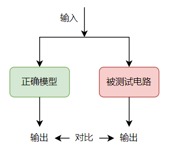
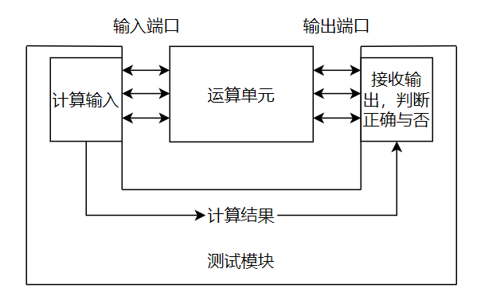
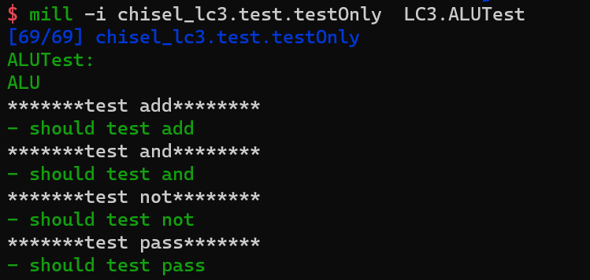
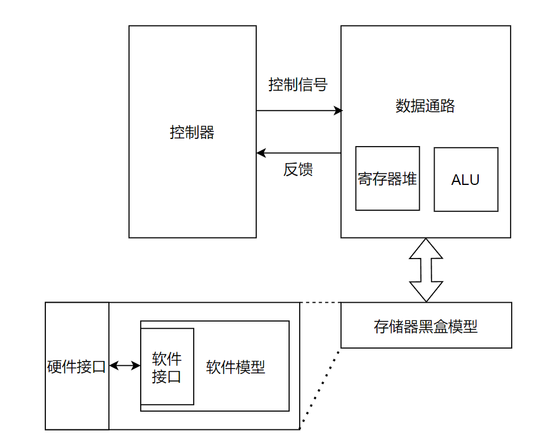
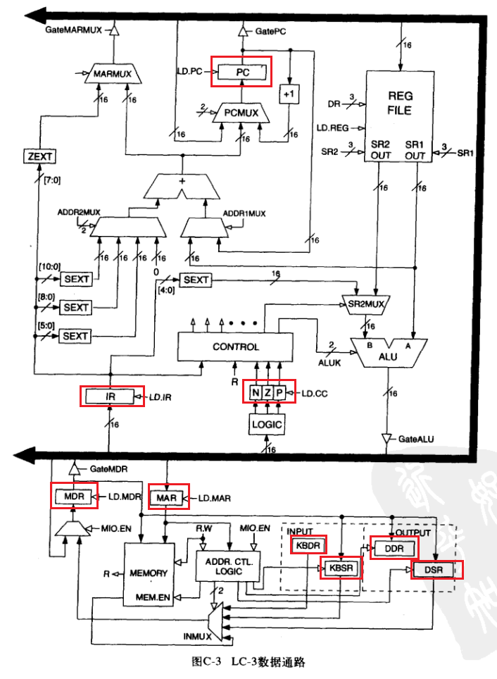
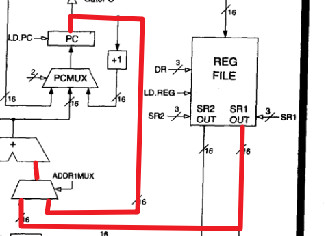
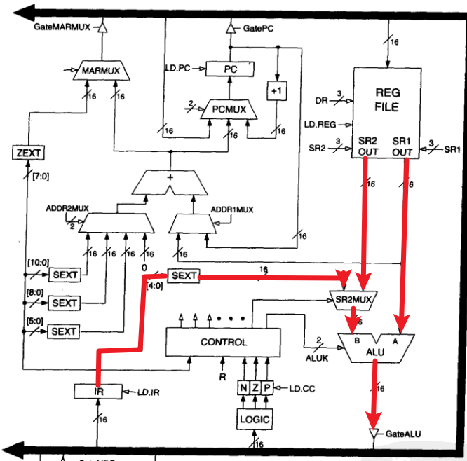

LC3数据通路的设计与验证
=======================

实验目的
--------

- 熟悉LC3微结构，具体请仔细阅读 **《计算机系统概论》 附录C**
- 了解LC3数据通路原理以及ALU和Regfile的设计与验证。

实验设备    
--------
- Ubuntu操作系统的电脑一台，或装有Ubuntu操作系统的虚拟机

实验任务
--------

- 使用chisel实现并验证LC3的ALU和Regfile
- 使用chisel完善LC3的数据通路

实验内容
--------
本章实验内容首先设计ALU模块和Regfile模块，然后完善其他数据通路，最后将ALU和Regfile模块组合成完整数据通路。

ALU设计
****************

**端口**：LC3 ALU模块中需要接收三个输入，即操作数1，操作数2，和操作类型，并且得到一个输出。

============== ======= =========
端口名称        方向    位宽   
============== ======= =========
操作数1         输入   16 bits  
操作数2         输入   16 bits
操作类型        输入   2 bits
输出数据        输出   16 bits 
============== ======= =========

**逻辑功能**：LC3 ALU中支持的运算操作为四类，加法，按位或，按位反以及取操作数1。
在ALU运算时会根据上述的输入类型进行选择做何种运算（2bits的操作类型可表示四种操作），其中操作类型的2bits来自于数据通路的SIG_ALUK。

============== ==============
操作类型        功能 
============== ==============
SIG_ALUK = 0    加法
SIG_ALUK = 1    按位与
SIG_ALUK = 2    对操作数1取反
SIG_ALUK = 3    取操作数1
============== ==============

**模块设计**
    
在有了上述端口和功能描述后，将其用Chisel代码描述。

**Task1** (src/main/scala/LC3/ALU.scala) 编写ALU逻辑。

.. code-block:: scala

    class ALU extends Module{
      val io = IO(new Bundle{
        val ina = Input(UInt(16.W))
        val inb = Input(UInt(16.W))
        val op  = Input(UInt(2.W))    //ADD,AND,NOT,PASSA
        val out = Output(UInt(16.W))
      })
      val result = Wire(UInt(17.W))

      io.out := DontCare
      result := DontCare

      // lab4-task1
      // 在此编写运算器逻辑

    }

ALU验证
****************
完成设计之后，我们需要对ALU的功能进行验证。除了在第三章中使用简单的结果观察方法(容易出错)，在数字电路中的验证方法通常采用一个正确的模型(golden modle)去和我们的设计进行对比。
给正确模型和被测试的电路给同样的输入，判断输出是否正确。

在chisel设计中最容易获得的模型便是使用scala编写的，从另一个角度看第三章单元测试的原理图，其结构大致相同，只是模块的输入输出不再是自己定义而是由程序自己计算好。
原理如下图所示。

ALU 测试代码如下：

.. code-block:: scala

    // src/test/scala/ALUTests.scala

    def TEST_SIZE = 10  // 定义测试数量

    val ina, inb, add_out, and_out, not_out, pass_out = Array.fill(TEST_SIZE)(0)  // 定义正确模型的输入和输出

    for (i <- 0 until TEST_SIZE) {
        ina(i) = Random.nextInt(0xffff)   // 输入采用随机数生成，因此也叫随机测试
        inb(i) = Random.nextInt(0xffff)   
        add_out(i) = ina(i) + inb(i)      // 以下4行是正确模型计算的结果。
        and_out(i) = ina(i) & inb(i)    
        not_out(i) = 0xffff-ina(i)
        pass_out(i) = ina(i)
    }

    it should "test add" in {             // 此处为add功能的测试用例，其他测试用例见源码
        test(new ALU) { c =>
            for(i <- 0 until TEST_SIZE) { 
                c.io.ina.poke(ina(i).U)                 // 对ina端口输入数据
                c.io.inb.poke(inb(i).U)                 // 对inb端口输入数据
                c.io.out.expect(add_out(i).U(15,0))     // 检测out端口输出，并比对正确模型结果
            }
        }
    }

输入如下命令对ALU进行仿真验证。

.. code-block:: shell

    mill chisel_lc3.test.testOnly LC3.ALUTest

若验证正确，获得仿真以下结果

Regfile设计和验证
******************
**端口**：对一个寄存器堆需要做的操作主要有读和写。在LC3的指令中最多需要读取两个数据，写入一个数据。
因此需要两组读端口一组写端口，每组端口需要一个地址和数据。此外还需要一个信号来判断是否为写信号(在datapath中该信号为LD_REG)，只有该信号为真才可以改变寄存器里的数据。

============== ======= =========
端口名称        方向    位宽   
============== ======= =========
读地址1         输入    3 bits  
读数据1         输入    3 bits
读地址2         输入    16 bits
读数据2         输出    16 bits 
写地址          输入    3 bits 
写数据          输入    16 bits
写使能          输入    1 bits
============== ======= =========

**逻辑功能**：根据 LC3 的设计，寄存器堆深度为8，宽度为16。读操作时，改变写地址的数据。读数据时，读数据端口为读地址的寄存器数据。

**模块设计**

在有了上述端口和功能描述后，用Chisel代码描述Regfile。

    **Task2** (src/main/scala/LC3/Regfile.scala) 编写Regfile逻辑。

.. code-block:: shell

  //src/main/scala/LC3/Regfile.scala

  class Regfile extends Module{
    val io = IO(new Bundle {
      val wen = Input(Bool())
      val wAddr = Input(UInt(3.W))
      val r1Addr = Input(UInt(3.W))
      val r2Addr = Input(UInt(3.W))
      val wData = Input(UInt(16.W))
      val r1Data = Output(UInt(16.W))
      val r2Data = Output(UInt(16.W))
    })
  
    io.r1Data := DontCare
    io.r2Data := DontCare
  
    // lab4-task1
    // 在此编写寄存器堆逻辑
  
  } 
|
  自此我们已经验证过控制器和ALU模块，请自己尝试搭建验证框架对Regfile模块进行验证。

    **Task3** (src/test/scala/RegfileTest.scala) 编写Regfile进行读写测试，即对某个寄存器进行写操作，再读该寄存器进行读操作，对比写入和读出数据是否一样。

完成设计和验证后输入如下命令对Regfile进行验证。

.. code-block:: shell

    mill chisel_lc3.test.testOnly LC3.RegfileTest

完善数据通路
**************

**存储器模型**

对于完整的数据通路，我们还需要一个存储器模块，由于仿真期间需要将程序代码初始化到存储器中，因此我们采用软件模型代替硬件模块以便于初始化。
其软硬件模型如下图所示：

其中存储器黑盒模型指的是，硬件只关注接口，将内部设计视为黑盒，内部设计部分将由软件编写模型。
首先定义存储器接口，端口信号及描述如下表：

============== ======= =========
端口名称        方向    位宽   
============== ======= =========
读地址1         输入    16 bits  
读数据1         输出    16 bits
写地址          输入    16 bits 
写数据          输入    16 bits
写使能          输入    1 bits
访存完成        输出    1 bits
内存映射        输入    1 bits
============== ======= =========

其次，根据硬件接口定义软件接口和软件模型。存储器模型可以简单认为对一个一维数组进行读操作和写操作，其主要代码如下：

.. code-block:: c

  // src/test/csrc/ram.cpp

  static paddr_t ram[RAMSIZE]; // 定义存储器

  // ...

  extern "C" void ram_helper(paddr_t rIdx, paddr_t *rdata, 
    paddr_t wIdx, paddr_t wdata, uint8_t wen) {  // 对应硬件接口的前五个

    *rdata = ram[rIdx];                         // 读操作
    if (wen) ram[wIdx] = wdata;                 // 写操作

  }

  // ...

最后，编写黑盒模型将上述硬件接口、软件接口和软件模型结合起来，代码如下：

.. code-block:: scala

  // src/test/scala/ALUTests.scala

  class RAMHelper() extends BlackBox {
  val io = IO(new Bundle {
    val clk = Input(Clock())
    val rIdx = Input(UInt(16.W))
    val rdata = Output(UInt(16.W))
    val wIdx = Input(UInt(16.W))
    val wdata = Input(UInt(16.W))
    //val wmask = Input(UInt(16.W))
    val wen = Input(Bool())
  })

  class Memory extends Module {   // 硬件模块
    val io = IO(new Bundle {      //硬件接口
    val raddr = Input(UInt(16.W))
    val rdata = Output(UInt(16.W))
    val waddr = Input(UInt(16.W))
    val wdata = Input(UInt(16.W))
    val wen = Input(Bool())
    val R = Output(Bool())
    val mio_en = Input(Bool())
  })

    val mem = Module(new RAMHelper())  // 例化黑盒

    // 软硬件接口相连接
    mem.io.clk := clock             
    mem.io.rIdx := io.raddr             
    io.rdata := mem.io.rdata              
    mem.io.wIdx := io.waddr             
    mem.io.wdata := io.wdata              
    mem.io.wen := io.wen              

    io.R := RegNext(io.mio_en)
  }

**完善数据通路**

自此我们已经完成 ALU、 Regfile 和存储器模块，接下来我们需要编写数据通路并例化上述三个模块。

由于数据通路较为庞大，在完善数据通路时需要对整个电路的全局比较了解，建议多阅读“图纸"。
对于数据通路设计步骤如下：

1. 定义数据通路模块端口。

2. 定义通路中的寄存器和关键线网。
   
3. 例化上述两个个子模块。
   
4. 根据控制信号对数据通路的寄存器和线网以及子模块端口进行连线。

由于数据通路模块与控制器，存储器相连，此外还有部分顶层模块端口，所有端口如下表展示：

==============  ================================
端口名称         含义
==============  ================================
signal          从控制器发来的控制信号
out             发送到控制器的反馈信号
mem             与存储器的接口，包括读写信号
initPC          与顶层的连线，用于初始化
uartRx          与顶层的连线，用于接收顶层信号
uartTx          与顶层的连线，用于发送信号到顶层
end             程序结束时，告知控制器
==============  ================================

模块及端口定义代码描述如下：

.. code-block:: scala

  class DataPath extends Module {
    val io = IO(new Bundle{
      val signal = Input(new signalEntry)
      val mem = Flipped(new MemIO)
      val out = new FeedBack

      val initPC = Flipped(ValidIO(Input(UInt(16.W))))
      val uartRx = Flipped(DecoupledIO(UInt(8.W)))
      val uartTx = DecoupledIO(UInt(8.W))

      val end = Output(Bool())
    })

    // 逻辑代码...

  }

根据数据通路架构图，其中定义的寄存器如下图表所示：

============== =========  =  ============== =========  
寄存器名称      位宽          寄存器名称      位宽       
============== =========  =  ============== =========  
PC              16 bits      N              1 bits   
IR              16 bits      Z              1 bits   
MAR             16 bits      P              1 bits   
MDR             16 bits      **BEN**        1 bits   
KBDR            16 bits      **RESET_PC**   16 bits
KBSR            16 bits      **PSR**        16 bits
DDR             16 bits       
DSR             16 bits       
============== =========  =  ============== =========  

（粗体寄存器为图纸中没有标记但实际设计需要）

寄存器定义与模块例化代码如下：

.. code-block:: scala

  val regfile = Module(new Regfile) //例化模块
  val alu = Module(new ALU)

  val BEN = RegInit(false.B)      //定义寄存器并初始化
  val N = RegInit(false.B)
  val P = RegInit(false.B)
  val Z = RegInit(true.B)

  val PC  = RegInit("h3000".U(16.W))
  val RESET_PC  = RegInit("h3000".U(16.W))

  val IR  = RegInit(0.U(16.W))
  val MAR = RegInit(0.U(16.W))
  val MDR = RegInit(0.U(16.W))
  val PSR = RegInit(0.U(16.W))

  val KBDR = RegInit(0.U(16.W))
  val KBSR = RegInit(0.U(16.W))
  val DDR  = RegInit(0.U(16.W))
  val DSR  = RegInit(0.U(16.W))

如果说定义模块、定义寄存器、例化是创造“积木”，那么连线就是把这些“积木”搭起来。
在连线时，除了寄存器的直连，通常会有条件控制，如下图所示，addr1mux信号选择输出的线路是 PC 值还是寄存器口出来的值。
对应示例代码为 ``val ADDR1MUX = Mux(SIG.ADDR1_MUX, regfile.io.r1Data, PC)``

|

此外对于子模块的连接，则是将线网连接到模块端口，如下图所示：

|

连接ALU子模块示例代码如下：

.. code-block:: scala

  val offset5  = SignExt(IR(4,0),  16)  //imm

  val SR2MUX = Mux(IR(5), offset5, regfile.io.r2Data)

  alu.io.ina := regfile.io.r1Data
  alu.io.inb := SR2MUX
  alu.io.op := SIG.ALUK
|

  **Task4** (src/main/scala/LC3/Datapath.scala) 根据控制信号，分别编写由LD信号控制的寄存器值改变逻辑，Gate信号控制数据源的选择逻辑，和Mux信号控制的数据选择逻辑。