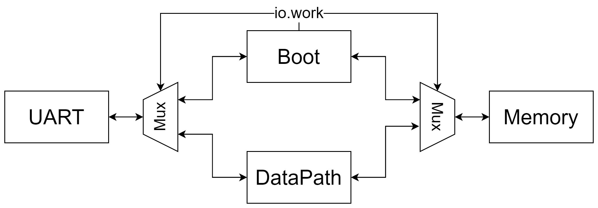
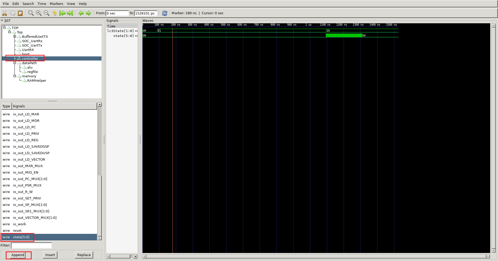
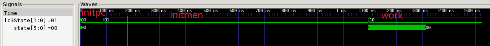
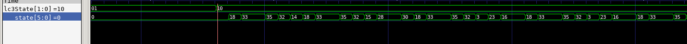
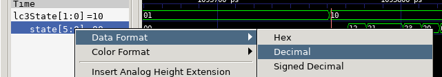

LC3的启动与仿真
=======================

实验目的
--------

- 了解UART串口通信的原理以及实现
- 了解LC3顶层的模块例化与连线
- 了解LC3的启动原理与仿真过程

实验设备    
--------
- Ubuntu操作系统的电脑一台，或装有Ubuntu操作系统的虚拟机

实验任务
--------

- 学习UART通信协议，使用C++编写出用于仿真的UART接口
- 学习LC3顶层模块的关系，将几个主要模块连接起来
- 使用chisel实现LC3的启动Boot
- 仿真运行LC3并使用gtkwave查看波形

实验内容
--------

UART通信功能设计
********************

一个完整的计算机系统分为软件和硬件两大部分，其中软件部分包括系统软件和应用软件，硬件部分则是运算器、控制器、存储器、输入设备、输出设备五大部分，本节主要讨论的就是一个计算机系统的输入和输出。

在之前的实验中，所有的输入信息都是在代码中写好了的，而输出信息都是靠Chisel和C++自带的printf函数来实现，printf函数固然方便好用，但printf只存在于仿真中，真正的硬件环境中肯定是难以实现的，如果考虑将LC3系统真正在FPGA上运行时，外部如何与LC3内部进行通信就是一个必须要思考的问题。

通用异步收发器（Universal Asynchronous Receiver/Transmitter)，通常称作UART，是一种串行、异步、全双工的通信协议，在嵌入式领域应用的非常广泛。特点是原理简单，易于实现，但是在需要远距离传输，以及对传输速率有一定要求的情况下不适用，显然只需要最简单的发送/接收功能，因此UART是完全可以胜任的。

.. hint::
    UART协议的详细介绍和参考verilog代码详见FPGA开发指南第十八章

希望同学们能够阅读UART相关的代码，包括硬件实现代码和软件仿真代码，可以尝试修改UART的波特率。

.. LC3顶层设计
.. ********************

.. UART负责了计算机系统中的输入输出部分，那么剩余的运算器、控制器、存储器则分别是由我们之前实验介绍的DataPath、Controller、Memory来负责，在本次实验中，需要在顶层文件中将这些模块例化，并且正确的连接。其中最主要的是另外一个模块：Boot模块。

.. Boot模块，顾名思义，是为了启动系统而添加的模块。在整个系统上电刚开始运行时，整个系统的内存是空的，因此我们需要指定程序起始的pc，还要把程序初始化到对应的内存地址中。在仿真时，我们使用内存的是用C++代码模拟的，因此我们可以在顶层函数仿真前对内存进行初始化，把需要运行的程序写进内存。但是当系统真的要放在FPGA上运行时，这方法就不可行了，用FPGA上真实的RAM来实现内存，哪怕我们对RAM做初始化，那么每次我们想运行一个新的程序时，就要重新编写RAM的初始化文件，并且重新烧录一次FPGA，这显然是不能接受的。因此，我们设计了Boot模块，Boot模块有三个状态，在开始时，Boot模块处于initpc状态，它会等待UART端口，我们通过串口调试助手，将我们想运行的程序直接传送给LC3，按照LC3系统的执行文件格式，前2Byte代表的是程序的起始地址，之后是程序指令，Boot在initpc状态下，接受UART的2Byte数据，以此作为程序运行的起始地址，然后进入initmem状态，在这个状态下，它会连续的接受UART传来的数据，并将它们按照顺序存入起始地址之后的内存中。当检测到UART没有数据再传来时，进入work状态，开始运行起始地址之后的程序。

.. 因为负责了初始化内存，因此在系统刚上电时，UART接口和内存的写口都是和Boot模块相连接的，在初始化内存完成后，再将UART和内存改为与DataPath连接，通过Boot模块输出一个work信号来判断是否完成了内存初始化。下面是一个简单的示意图：

Boot状态和控制设计
********************

**功能**：

- 接收Uart传输的LC3程序数据，每周期接收8bits，至少需要2周期接收完一个16bits指令或数据。
  Uart接收到数据时uartValid会置高，前8bits会寄存一拍，第二拍接收后8bits会与前面拼接成16bits并且置wordValid为高。
- 控制LC3的状态并根据状态控制Memory的工作

**流程**：LC3在的工作过程主要分为三步，在代码设计中分为三个状态：

- initpc: 初始化PC，在LC3汇编中的第一个数据即为PC，需要将该数据存入到一个寄存器中,该数据来源于Uart。
- initmem: 初始化内存，程序内容需要逐个放入Memory中。
- work:执行程序。

    Lab5-task1(src/main/scala/LC3/Boot.scala):编写状态转换以及控制信息。

    fig5-1: Boot控制UART和内存的连线

在完成Boot代码编写后，可以到Top.scala文件中，看看Boot、Controller、DataPath、Memory四个模块是怎么例化连线的，重点可以对照图5-1，看看Boot是如何控制UART和Memory的。

运行仿真
*********

在image目录下存在默认程序dummy.obj，默认程序会向uart输出Hello!并打印到屏幕上。运行make emu TRACE=-t会执行编译和运行dummy.obj并打印波形文件emu.vcd。
加IMAGE=$your_file选项可以执行指定的程序。
最终波形会生成在build/文件夹下的emu.vcd。
用波形工具gtkwave打开emu.vcd ``gtkwave build/emu.vcd``

在gtk界面中选择查看的信号添加到波形面板

    fig5-2: 波形面板

可以看见lc3state的状态转换经历3个过程

    fig5-3: lc3state变化
 
观察lc3state状态为work的情况下控制器的state，与状态机转换一致，其中状态18则为每条指令的第一个状态。
 

    fig5-4: 状态机

注意，波形数值默认不是十进制数，方便观察建议转换到对应进制。

    fig5-5: 十进制显示
|

    Lab5-task2:在波形中观察ALU的4个功能在波形上的表现是正确的。

.. tip::
    1. 找出哪些指令用到ALU的功能。
    2. 查看alu模块端口信号看是否满足预期。

