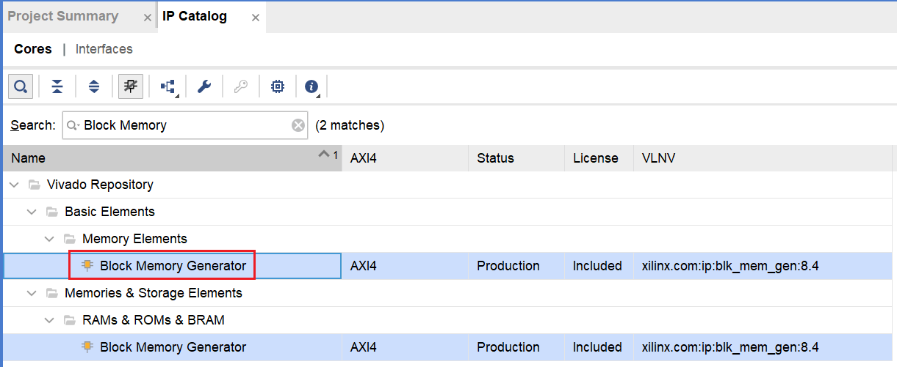
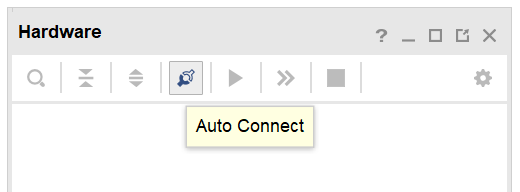

LC3-FPGA上板运行
===================

实验目的
---------

- 在电脑上安装vivado
- 学会在vivado上建立项目
- 了解将程序烧入FPGA的流程

实验设备    
--------
- Ubuntu操作系统的电脑一台，或装有Ubuntu操作系统的虚拟机
- 一块FPGA板，指导中使用的是达芬奇FPGA开发板，上面搭载的主控芯片是Xilinx Artix7系列XC7A35T
- vivado软件，指导中使用的是v2020.1
- FPGA开发指南
- vivado license

实验任务
--------

- 安装vivado
- 准备LC3顶层verilog文件
- 建立LC3的vivado项目
- 将LC3烧录到FPGA上运行

安装vivado
--------

由于vivado对电脑资源占用较大，因此不建议装在虚拟机中，最好装在原系统上，参考Xilinx的官方文档进行vivado的 `下载和安装 <https://china.xilinx.com/content/dam/xilinx/support/documentation/sw_manuals/xilinx2020_1/ug973-vivado-release-notes-install-license.pdf#namedDest=xDownloadingTheVivadoDesignSuiteTools>`_

`这里 <https://blog.csdn.net/hpf821010/article/details/115893404>`_ 给出了vivado安装过程的截图

实验内容
--------

准备LC3顶层verilog文件
****************************

首先需要做的不是建立一个新的vivado项目，而是先生成需要的用来烧录FPGA的verilog文件，这个文件跟仿真时生成的verilog文件还有些微的不同，具体在Memory.scala文件中。
可以看到三种Memory的定义，而在生成verilog的过程中，具体使用哪种Memory，取决于CoreConfig.FPGAPlatform和CoreConfig.REPLACE_MEM两个变量的值，这两个变量在Top.scala文件中定义。
接下来介绍这三种Memory不同的适用场景：

1. 当FPGAPlatform为false时，代表只需要仿真即可，此时会生成RAMHelper模块，这是一个用DPI-C导入的一个C程序，其本质就是C++中的一个数组，根据接口信号读取和写入对应位置的元素。之所以在仿真时要使用C++来仿真ram，是因为需要在整个LC3系统运行起来之前，给ram中初始化一些需要的程序，比如说一些trap程序，启动程序。虽然这个直接用verilog来编写也可以做到，但是还是用C++来实现更加灵活简单。
2. 当FPGAPlatform为true时，代表你不需要用于仿真，而是要用于其他的功能，首先当REPLACE_MEM为false时，会生成lut_mem模块，这就是一个用verolog写的最简单的ram，没有ram初始化功能，这样生成的verilog其实是不能正常运行的，虽然它的电路都有，但是因为ram中没有程序，所以电路的行为不确定，这种配置主要是用于给后端做一些布局布线时使用，因为如果像在FPGA上运行的verilog使用了第三方ram的ip，会导致综合出来的ram是空的。
3. 当FPGAPlatform为true且REPLACE_MEM为true时，代表你需要将生成的verilog代码烧录到FPGA上运行。此时会生成一个dual_mem模块，可以看到这是个空模块，内部没有任何的逻辑。其实这个模块是一个FPGA上的第三方ip核，接下来会在vivado中引入这个ip核，这样在FPGA综合时，就会使用FPGA上的ram资源，而不是直接使用lut搭建一个ram，直接使用lut搭建ram，FPGA板卡上的lut资源是不够的。**在本实验中应该使用第3种配置**。

配置完之后就可以使用make verilog命令生成需要在FPGA上运行的verilog文件了。

建立LC3的vivado项目
****************************

在vivado新建一个项目，起一个项目名，比如指导中给项目命名为lc3_fpga

    fig6-1: 新建项目窗口1
|

    fig6-2: 新建项目窗口2

建立完项目后，记得将TopMain.v文件放到刚建好的项目路径中，然后在项目中点击Add Sources按钮，将TopMain.v文件添加到项目中

.. figure:: _static/image005.png
    :alt: controller
    :align: center

    fig6-3: 添加Source文件1
|

    fig6-4: 添加Source文件2
|

.. figure:: _static/image009.png
    :alt: controller
    :align: center

    fig6-5: 添加Source文件3

导入成功后，你可以在vivado的Sources窗口中看到LC3的几个基本模块，但是可以看到在memory中dual_mem是一个没有找到对应模块的状态。接下来就要在vivado中添加对应的ip核。

.. figure:: _static/image011.png
    :alt: controller
    :align: center

    fig6-6: 没有找到对应模块的dual_mem

添加ip核，首先点击Flow Navigator窗口中的IP Catalog按钮，在弹出的窗口中搜索Block Memory，选择Block Memory Generator

    fig6-7: IP Catalog按钮位置

按照下图的配置好参数，点击OK按钮，然后弹出的窗口直接点击Generate。

.. hint::
    关于FPGA中RAM的使用和相关配置参数的含义，可以参考FPGA开发指南中的第16章

    fig6-8: Block Memory Generator位置
|

    fig6-9: dual_mem配置1
|

.. figure:: _static/image019.png
    :alt: controller
    :align: center

    fig6-10: dual_mem配置2 
|

    fig6-11: dual_mem配置3
|

    fig6-12: dual_mem配置4
|

.. figure:: _static/image025.png
    :alt: controller
    :align: center

    fig6-13: 生成dual_mem确认窗口

等待界面右上角把ip核生成完毕，可能会需要较长的时间，请耐心等待

.. figure:: _static/image027.png
    :alt: controller
    :align: center

    fig6-14: 生成ip核中
|

.. figure:: _static/image029.png
    :alt: controller
    :align: center

    fig6-15: ip核生成完成

编译完成后在Sources窗口下点击切换到IP Sources标签页，可以看到生产的ram，点开dual_mem_stub.v可以看到，之前chisel中定义的dual_men接口与生成的ram接口是一致的，与此同时，在Hierachy标签页中，dual_mem的图标已经改变了

.. figure:: _static/image031.png
    :alt: controller
    :align: center

    fig6-16: 生成完的ip核相关文件
|

    fig6-17: 生成对应模块后的dual_mem

接下来要为vivado项目添加一个约束文件，这一步与添加Source文件类似，只是由选择Add or create design sources变为了Add or create constraints，这个文件主要是用来将LC3的时钟、复位接口和Uart接口与FPGA上对应的引脚连接，注意这里并没有将reset按钮映射到FPGA的reset按钮上，而是映射到了KEY0按钮上。因为如果映射到reset按钮上，只有reset按钮一直处于按下的状态，系统才会正常工作。后半部分的功能主要是为了生成的bit流文件转换成固化文件后能够适用于4bit位宽SPI通信的flash器件，代码如下：

.. hint::
    如果需要修改对应的按键，可以参考附件中的FPGA开发板IO引脚分配表，其中给出了FPGA板上所有按键对应的编号

.. code-block:: perl

    create_clock -period 20.000 -name clk [get_ports clock]
    set_property -dict {PACKAGE_PIN R4 IOSTANDARD LVCMOS33} [get_ports clock]
    set_property -dict {PACKAGE_PIN T1 IOSTANDARD LVCMOS33} [get_ports reset]
    set_property -dict {PACKAGE_PIN U5 IOSTANDARD LVCMOS33} [get_ports io_uart_rxd]
    set_property -dict {PACKAGE_PIN T6 IOSTANDARD LVCMOS33} [get_ports io_uart_txd]

    set_property CFGBVS VCCO [current_design]
    set_property CONFIG_VOLTAGE 3.3 [current_design]
    set_property BITSTREAM.GENERAL.COMPRESS true [current_design]
    set_property BITSTREAM.CONFIG.CONFIGRATE 50 [current_design]
    set_property BITSTREAM.CONFIG.SPI_BUSWIDTH 4 [current_design]
    set_property BITSTREAM.CONFIG.SPI_FALL_EDGE Yes [current_design]

    fig6-18: 添加约束文件1
|

    fig6-19: 添加约束文件2

接下来要再在vivado中指定一个顶层，将的Top模块再包一层，这个顶层文件只在vivado做仿真时会使用，并不会真正被烧录到FPGA中。
和之前添加TopMain.v一样，只不过这次选择Add or create simulation sources选项

.. figure:: _static/image039.png
    :alt: controller
    :align: center

    fig6-20: 添加仿真文件

然后直接点OK，在Sources窗口中找到test.v文件，test.v的参考代码如下：

.. code-block:: verilog

    `timescale 1ns / 1ps // 代表仿真时间单位/时间精度，这里代表的是1ns是基础的时间单位，而时间单位最多可以精确到1ps，例如使用verilog中的延时语句，#1代表延时1ns，1ps表示延时最多可以精确到小数点后3位，即0.0001ns
    module test();
        reg sys_clk;
        reg sys_rst_n;
    
        wire txd; // 连接UART接口
    
         initial begin // 给时钟赋初值，reset信号最开始是有效的，在100ns后reset信号撤销
            sys_clk = 1'b0;
            sys_rst_n = 1'b1;
            #100
            sys_rst_n = 1'b0;
        end
    
        always #10 sys_clk = ~sys_clk; // 设置时钟每10ns反转一次，则一个时钟周期是20ns
    
    
        Top top( // 实例化LC3顶层模块
            .clock(sys_clk),
            .reset(sys_rst_n),
            .io_uart_rxd(1'b0),
            .io_uart_txd(txd)
        );
    
    endmodule

然后在Sources窗口中大概能看到这样的组织结构

.. figure:: _static/image041.png
    :alt: controller
    :align: center

    fig6-21: 所有文件添加完后的项目结构

烧录并运行
***********

接下来点击Flow Navigator窗口中的Generate Bitstream按钮，综合生成bit文件，弹出的对话框中不用修改配置，Yes，OK即可。这部分过程比较久，请耐心等待，可以看vivado右上角来判断状态，生成完成后会弹出对话框，选择Generate Memory Configuration File，然后点OK，如果一不小心关闭了这个对话框，也可以在菜单栏的Tools菜单中找到

.. figure:: _static/image043.png
    :alt: controller
    :align: center

    fig6-22: 生成bit文件按钮
|

.. figure:: _static/image045.png
    :alt: controller
    :align: center

    fig6-23: 弹出对话框选择生成mcf文件

接着按照下图格式进行配置，点击OK后，看到弹出对话框，表示mcf文件已经生成成功

.. figure:: _static/image047.png
    :alt: controller
    :align: center

    fig6-24: 生成mcf文件配置
|

.. figure:: _static/image049.png
    :alt: controller
    :align: center

    fig6-25: mcf文件生成成功提示窗口

接下来就要正式开始烧录了，首先需要连接好开发板，先将FPGA板上的JTAG下载接口连接好，接口的具体位置可以参考FPGA开发指南第二章的2.1.1节图示，通过这个接口将我们的程序烧录到FPGA上自带的Flash中，这样在开机后FPGA就会从Flash中运行我们烧录好的程序。

其次一个系统必须要有输入输出，因此还需要连接UART接口，同时在电脑上安装串口调试助手，来传输和接收我们的程序输入输出。

在连接完成后按下蓝色开关，给FPGA上电

.. figure:: _static/image051.png
    :alt: controller
    :align: center

    fig6-26: FPGA连接对应的数据线

接下来在Flow Navigator窗口中点击Open Hardware Manager按钮

.. figure:: _static/image053.png
    :alt: controller
    :align: center

    fig6-27: 打开硬件管理器

点击Hardware窗口中的Auto Connect按钮

    fig6-28: 自动连接按钮

看到下图所示的画面，代表已经连接成功了

    fig6-29: 连接上FPGA后的视图

接下来要在项目中为开发板添加一个固化Flash部件，选中芯片右键选择Add Configuration Memory Device   

.. figure:: _static/image059.png
    :alt: controller
    :align: center

    fig6-30: 右键添加Flash
|

.. figure:: _static/image061.png
    :alt: controller
    :align: center

    fig6-31: 选择FPGA支持的Flash型号

然后会询问你是否要烧写新添加的Flash，选择OK，如果不小心关闭了对话框，在新添加的Flash上右键，选择Program Configuration Memory Device

.. figure:: _static/image063.png
    :alt: controller
    :align: center

    fig6-32: Flash添加完成后弹出窗口，询问是否进行烧录

接下来要选择刚才生成的mcf文件，还有和mcf文件在同一目录下的prm文件，按照下图配置完成后点击OK，就会开始烧录，烧录完成后会弹出窗口，此时在Hardware窗口中可以看到多出了一个Flash的图标

.. figure:: _static/image065.png
    :alt: controller
    :align: center

    fig6-33: Flash烧录配置
|

    fig6-34: Flash烧录成功提示 
|

.. figure:: _static/image069.png
    :alt: controller
    :align: center

    fig6-35: Flash添加成功后视图

接下来打开串口调试助手，在FPGA上电启动的情况下，我们选中FPGA对应的串口（不同的电脑可能对应的串口号不同，指导中的是COM4），然后配置好对应得波特率等参数，选择发送文件，然后将希望运行的程序的obj文件通过串口传输给FPGA，其中的LC3 启动程序会自动接收你想要运行的程序，将它存入RAM中，然后开始执行，下图是一个最简单的程序，它通过串口输出Hello!

.. figure:: _static/image071.png
    :alt: controller
    :align: center

    fig6-36: Hello程序运行成功截图
当然也可以运行一些带交互的程序，下图首先给FPGA传输一个计算机系统实验四里的MIN小游戏程序，然后在通过串口输入与LC3交互，实现游玩游戏的过程。

.. figure:: _static/image073.png
    :alt: controller
    :align: center

    fig6-37: min游戏运行截图1
|

    fig6-38: min游戏运行截图2

实验总结
----------
通过本节课，希望大家能够掌握：

- LC3如何生成可上板运行的verilog代码
- 如何新建一个Vivado工程，并配置生成LC3系统的烧录文件
- 使用串口调试助手在LC3上运行简单的汇编程序

